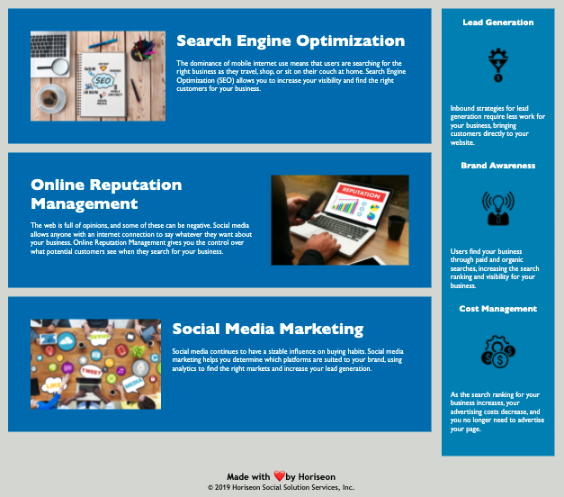

# Horiseon Refactor
Code Refactor Landing Page

GitHUB Repo Link: https://github.com/SamiF812/Refactor-Landing-Page

Working Horiseon Website: https://samif812.github.io/Refactor-Landing-Page/

Horiseon requested to have their website updated to met accesibility standards. Firstly, all links on the website must work. The primary goal was to optimze for search engines. The code must follow semantic structure and be in logical order. All images but have alt attributes that are descriptive.

Steps taken:

-Added a header and all links are now working properly. Search engine optimization was missing "id" attribute.

-CSS selectors and properties were consolidated. There was 3 groups using the same code. Now 1 class handles all styling.

-removed all div tags and replaced with section tags. This cleans up the code and allows for easier styling.

-added a nav element. This allowed for more semenatic structure of the source code. Also helped with styling in the css.

-class name changes allowed for easier styling.

-comments made on both the index and css files.

